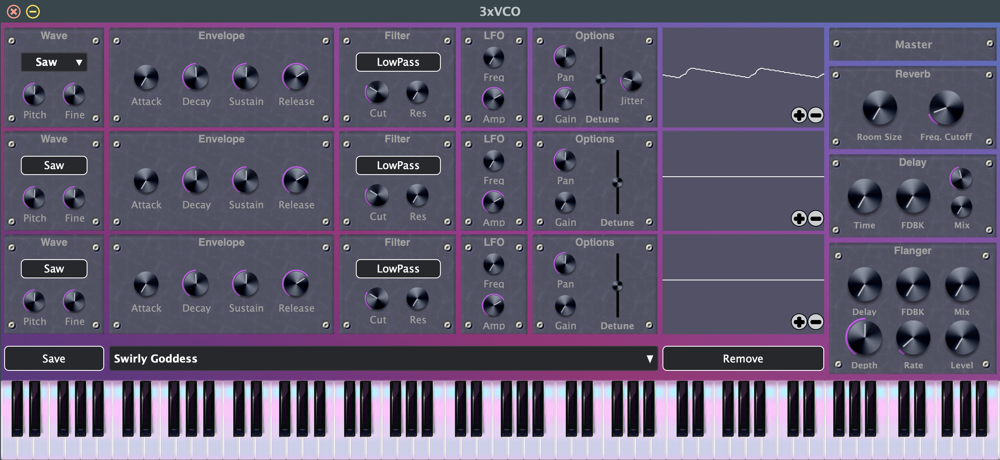

# 3xVCO-Subtractive-Synth
## Description
For my senior capstone project, I attempted to combine my passion for music with the 4 years of Computer Science knowledge I've accumulated in school. The result was the 3xVCO!

This was made using the wonderful front-end framework [Cabbage Audio](https://cabbageaudio.com) for [CSound](https://csound.com), a mature and robust audio-programming language. Cabbage provides numerous widgets and extra opcodes that allow developers to update CSound parameters in real-time, making plug-in effect and synthesizer creation a breeze. I am extremely grateful for this framework because it afforded me so much extra time to focus on the core functionality of the program.

## Installation 

For both Windows and MacOS, I would recommend downloading the Cabbage IDE and creating VST/AU exports directly from there. This is how I was able to transfer the project between operating systems when preparing for the final presentation. Then, all you *should* need to do is move the exported .component or .vst file to where the rest of your plugins reside to use it in your favorite DAW. I have had success with both Mac and Windows using this method. For Linux users, I assume you already know what you're doing enough to figure it out. But in all seriousness, feel free to contact me if you have any issues.

To break down the key features a little bit, I will go through each component of the system and offer as much detail as I can about its' purpose. One of my main inspirations for this project is the 3xOsc by image-line, the company behind FL Studio. So you may wish to look into their documentation for more general concepts behind how you might use a plug-in synthesizer such as this one.

## 1. The Source

This is where users can select from over 20 sounds available thanks to CSounds library of opcodes! Here is the comprehensive list:

* Saw 
* Square 
* Triangle 
* Noise 
* Buzz 
* FM Bell 
* FM B3 Organ 
* FM Perc 
* FM Metal 
* FM Rhode 
* Shaker 
* Bamboo 
* Snare 
* Kick 
* Sandpaper 
* Crunch 
* Sekere 
* Cabasa 
* WGPluck 
* WGBow

Using the source pane, users can then pitch the tone +/- 24 semitones, or two octaves. Additionally, there is a fine tune control of up to +/- 100 cents, allowing for complete control over the resulting frequency.

## 2. ADSR Amplitude Envelope

In this section, the user applies an envelope to the sound. If you're unsure what this means, it's a good idea to play around with the 4 knobs in this section and I guarantee you'll have a grasp on it in no time. Try a small decay, no sustain, and no release for a pluck-y sound! Then try a long attack and leave the decay and sustain knobs at their halfway point to obtain more of a pad noise.

## 3. The 'Rezzy' Filter

This is where a filter ( or lack thereof ) is applied to the sound chosen in the source component. There are three options here: A combobox for switching between high/low pass, a cutoff frequency knob, and a resonance knob. The cutoff frequency determines where the filtering occurs from ( for lowpass, all values above will be cut, for highpass, all values below will be cut ). The resonance is an interesting feature of resonant filters. It provides a boost in amplitude at the point in frequency where the cutoff occurs. It can provide interesting results, but use with caution.

## 4. LFO ( Low-Frequency Oscillation )

This is such a simple effect but perhaps my favorite part of the project. The LFO modulates the cutoff frequency in the pattern of a sine wave according to the frequency taken from the knob that resides in this pane. There is also an amplitude option so that you can mix the LFO sound in with the original filter cutoff. Combining this with some resonance on the filter creates the most fun sounds I could come up with on this synth.

## 5. Options

This is where basic settings for the signal can be configured. You have a panning and volume knob, and then a vertical slider for detune. This is taken directly from image-line's 3xOsc, a method of widening the sound wherein you take the frequency of the left channel and the right channel and push them apart using the positive and negative value provided by the slider.

## 6. The Effect Rack

There are 3 optional effects available in the 3xVCO: A reverb, a ping-pong delay, and a flanger. I'm aware these effects are rather ecclectic, but I wanted some basic additional processing to be possible all in one place with my synth. I experimented with distortion, phasers, chorus, a multi-mode delay, and in the end I just settled with these three because they seemed to create the best quality sounds. They also overlap with one another quite nicely. 

The reverb allows control through the feedback & cutoff knobs. The feedback knob controls the size of the 'room' to be emulated, and the cutoff decides how quickly to decay the higher frequencies of the sound, with higher cutoffs resulting in more 'bright' reverberation.

The delay will reproduce the sound one or more times after the initial output. It does so in a way that switches back and forth between the left and right channels to create a bouncy effect. You have control over the speed of the repetitions and the amount of repetitions through the time and feedback knobs, respectively. This delay also has a knob for filtering the delay each time it is repeated, and a mix for controlling how much of the final sound contains a delaying signal.

The flanger can actually serve the same purpose as the delay if it's configured the right way! Because at it's core, a flanger has a delayed version of the audio signal that is being fed back into the final output. However, the difference here is that the delay is being modulated by an LFO. This creates a sweeping effect when extreme parameters are selected, and a chorusy type effect at mild parameters. The default is a standard flanger noise, I encourage you to just turn up the level and mix to observe it's impact.

And that's it! There are a few additional features to the synth mostly made possible by Cabbage, such as the signal display and preset-saving feature. But the signal display isn't interactive and the preset-saving feature is standard in most DAWs by now. Feel free to message me with any questions or insights!

BH 2023
